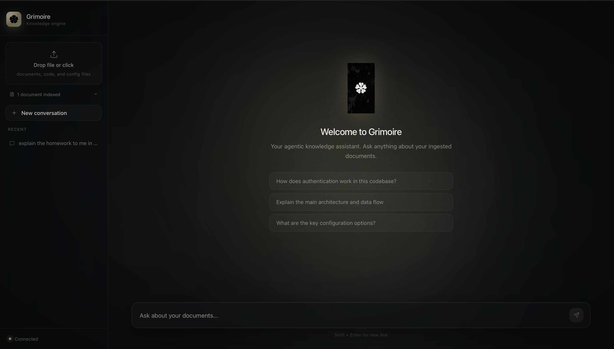

# Grimoire — Agentic Developer Knowledge Assistant

> A production-grade RAG system for querying developer documentation and codebases. Combines hybrid retrieval, LangGraph-orchestrated agents, and evaluated answer generation — deployable with a single API key.



---

## Quick Start (Docker — Recommended)

```bash
git clone https://github.com/soumyadeep-datta/grimoire.git
cd grimoire

cp .env.example .env
# Edit .env: add ANTHROPIC_API_KEY (required)

docker compose up
```

Open [http://localhost:3000](http://localhost:3000) — the full stack is running.

First build takes ~10 minutes (downloading Python + Node images, installing deps, building Next.js bundle). Subsequent runs start in ~5 seconds.

To stop: `docker compose down`. To wipe ingested data and start fresh: `docker compose down -v`.

---

## Evaluation Results

Evaluated on 20 questions using DeepEval with GPT-4o-mini as judge, Claude Sonnet 4.6 for generation.

| Metric | Score |
|---|---|
| Faithfulness | **0.9143** |
| Contextual Recall | **0.8794** |
| Answer Relevancy | **0.9126** |
| Contextual Precision | **0.9377** |

Reproduce: `python -m app.eval.evaluate --dataset eval_dataset_v2.json --output eval_report_v2.json`

---

## Architecture

### Retrieval Pipeline (4 stages)

```
Query
  │
  ├── 1. Dense search   ── Voyage-code-3.5 embeddings → Qdrant
  ├── 2. Sparse search  ── BM25S lexical index (in-memory, built at startup)
  │
  ├── 3. RRF fusion     ── Reciprocal Rank Fusion (k=60) merges both ranked lists
  │
  └── 4. Reranking      ── Cohere Rerank v4 cross-encoder → top-k results
```

**Why hybrid?** Pure dense search misses exact tokens (function names, error codes, API identifiers). Pure BM25 misses semantic similarity. RRF fusion eliminates both failure modes. Cohere Rerank adds cross-encoder precision as a second stage.

**AST-aware chunking:** Code files (`.py`, `.js`, `.ts`) are parsed via tree-sitter and split at semantic boundaries — functions, classes, methods — rather than arbitrary character limits. Each chunk includes a contextual header (file name, imports, parent class) following Anthropic's Contextual Retrieval pattern.

### Agent Architecture

```
User Query
    │
    ▼
LangGraph ReAct Agent (Claude Sonnet 4.6)
    │
    ├── Tool 1: rag_retrieval    — 4-stage hybrid pipeline over ingested docs
    ├── Tool 2: web_search       — Tavily (optional, excluded if no key)
    ├── Tool 3: database_query   — NL→SQL over SQLite knowledge base
    └── Tool 4: code_executor    — RestrictedPython sandbox
    │
    ▼
LangGraph SQLite Checkpointer (unified memory)
    │
    ▼
Answer with citations
```

**Unified memory:** Both agent mode and direct RAG mode write to the same LangGraph SQLite checkpoint store, keyed by `session_id`. History persists across server restarts and is consistent regardless of which query mode was used.

### Frontend

Next.js 16 + TypeScript. Streaming chat UI with source citation modals, file ingestion, session persistence, offline detection, and warm atmospheric styling. Connects to the backend via the standard REST API documented at `/docs`.

---

## Manual Setup (without Docker)

For development or environments where Docker isn't available.

### Requirements
- Python 3.12+
- Node.js 20+
- `ANTHROPIC_API_KEY` (required — everything else is optional)

### Backend

```bash
cd grimoire/backend

python -m venv .venv && source .venv/bin/activate
pip install -r requirements.txt

# Verify all dependencies installed correctly
python verify_setup.py

cp ../.env.example ../.env
# Fill in ANTHROPIC_API_KEY (required) and optional keys

uvicorn app.main:app --reload --port 8000
```

API docs: [http://localhost:8000/docs](http://localhost:8000/docs)

### Frontend

```bash
cd grimoire/frontend
npm install
npm run dev
```

UI: [http://localhost:3000](http://localhost:3000)

---

## API Reference

The full interactive API explorer is at [http://localhost:8000/docs](http://localhost:8000/docs) (Swagger UI) once the backend is running. Common operations:

### Ingest documents

```bash
# Ingest a file
curl -X POST http://localhost:8000/ingest \
  -F "file=@your_doc.md"

# Ingest raw text
curl -X POST http://localhost:8000/ingest/text \
  -H "Content-Type: application/json" \
  -d '{"content": "Your content here", "source_name": "my_doc.txt"}'
```

### Query

```bash
# Direct RAG (fast, ~4s)
curl -X POST http://localhost:8000/query \
  -H "Content-Type: application/json" \
  -d '{"question": "How does X work?", "session_id": "my-session", "use_agent": false}'

# Agent mode (full tool orchestration, ~15-30s)
curl -X POST http://localhost:8000/query \
  -H "Content-Type: application/json" \
  -d '{"question": "How does X work?", "session_id": "my-session", "use_agent": true}'

# Streaming (Server-Sent Events, used by the frontend)
curl -X POST http://localhost:8000/query/stream \
  -H "Content-Type: application/json" \
  -d '{"question": "How does X work?", "session_id": "my-session"}'
```

---

## API Keys

Only `ANTHROPIC_API_KEY` is required. Additional keys unlock better retrieval quality:

| Key | Provider | Effect if missing |
|---|---|---|
| `ANTHROPIC_API_KEY` | [console.anthropic.com](https://console.anthropic.com) | **Required** |
| `VOYAGE_API_KEY` | [dash.voyageai.com](https://dash.voyageai.com) — free 200M tokens | Falls back to `all-MiniLM-L6-v2` (local) |
| `COHERE_API_KEY` | [dashboard.cohere.com](https://dashboard.cohere.com) — free 1K/month | Skips reranking, uses RRF order |
| `TAVILY_API_KEY` | [app.tavily.com](https://app.tavily.com) — free 1K/month | Web search tool excluded from agent |
| `OPENAI_API_KEY` | [platform.openai.com](https://platform.openai.com) | Only needed for DeepEval evaluation |

> **Note:** Switching embedding providers (Voyage ↔ local) requires wiping the vector store (`DELETE /collections`) and re-ingesting documents, since embedding dimensions differ (1024 vs 384).

---

## Project Structure

```
grimoire/
├── docker-compose.yml           # Two services: backend + frontend
├── .env.example                 # Environment variable template
├── backend/
│   ├── Dockerfile               # Python 3.12 multi-stage build
│   ├── requirements.txt
│   ├── verify_setup.py
│   ├── app/
│   │   ├── main.py              # FastAPI routes + lifespan (eager init)
│   │   ├── config.py            # Pydantic settings with optional key handling
│   │   ├── agent/
│   │   │   ├── orchestrator.py  # LangGraph ReAct agent + SQLite checkpointer
│   │   │   ├── tools.py         # rag_retrieval, web_search, database_query, code_executor
│   │   │   └── prompts.py       # System prompt + RAG context template
│   │   ├── rag/
│   │   │   ├── retriever.py     # Hybrid pipeline: BM25S + dense + RRF + Cohere Rerank
│   │   │   ├── embeddings.py    # Voyage-code-3.5 with local fallback
│   │   │   ├── ingestion.py     # Document loading with AST routing
│   │   │   └── ast_chunker.py   # tree-sitter AST chunking for code files
│   │   └── eval/
│   │       ├── dataset.py       # QA pair generation from ingested docs
│   │       └── evaluate.py      # DeepEval scoring pipeline
│   ├── tests/                   # 83 tests, 75% coverage
│   └── eval_dataset_v2.json     # 20 evaluation questions
└── frontend/
    ├── Dockerfile               # Node 20 multi-stage build
    ├── next.config.ts
    └── src/
        ├── app/                 # Next.js App Router
        ├── components/          # Chat UI, sidebar, modals
        ├── hooks/               # useChat (streaming, retry, sessions)
        └── lib/                 # API client, connection context, toast
```

---

## Tech Stack

| Component | Technology |
|---|---|
| LLM | Claude Sonnet 4.6 |
| Embeddings | Voyage-code-3.5 (1024-dim) / all-MiniLM-L6-v2 fallback |
| Vector store | Qdrant (local persistent) |
| Sparse search | BM25S (in-memory, built at startup) |
| Reranking | Cohere Rerank v4 (`rerank-v4.0-fast`) |
| Fusion | Reciprocal Rank Fusion (k=60) |
| AST parsing | tree-sitter 0.25.x (Python, JS, TS) |
| Agent framework | LangGraph 1.2 + SqliteSaver checkpointing |
| Backend | FastAPI + Pydantic v2 |
| Frontend | Next.js 16 + TypeScript |
| Web search | Tavily |
| Evaluation | DeepEval 4.x, GPT-4o-mini judge |
| Observability | LangSmith |
| Deployment | Docker Compose |

---

## Running Evaluation

```bash
cd backend

# Generate evaluation dataset from ingested docs
python -m app.eval.dataset --output eval_dataset_v2.json --n-questions 20

# Run DeepEval scoring
python -m app.eval.evaluate --dataset eval_dataset_v2.json --output eval_report_v2.json
```

---

## Running Tests

```bash
cd backend
pytest tests/ -v --cov=app --cov-report=term-missing
```

83 tests, 75% coverage. Tests run without any API keys — all external services are mocked.

---

## Supported File Types

| Type | Extensions | Chunker |
|---|---|---|
| Code (AST) | `.py` `.js` `.ts` `.jsx` `.tsx` | tree-sitter (semantic boundaries) |
| Code (text) | `.go` `.rs` `.java` `.cpp` `.c` | RecursiveCharacterTextSplitter |
| PDF | `.pdf` | PyPDFLoader |
| Markup | `.md` `.markdown` `.html` `.htm` `.rst` | RecursiveCharacterTextSplitter |
| Plain text | `.txt` | RecursiveCharacterTextSplitter |
| Config | `.yaml` `.yml` `.json` `.toml` | RecursiveCharacterTextSplitter |

---

## Error Handling

Grimoire returns typed HTTP status codes — no generic 500s for upstream issues:

| HTTP Status | When |
|---|---|
| `404 Not Found` | No documents ingested yet |
| `409 Conflict` | Embedding dimension mismatch (switched providers without re-ingesting) |
| `415 Unsupported Media` | Unsupported file type |
| `429 Too Many Requests` | Anthropic, Voyage, or Cohere rate limit hit |
| `503 Service Unavailable` | Anthropic temporarily overloaded |
| `502 Bad Gateway` | Voyage or Cohere returned an unexpected error |
| `504 Gateway Timeout` | Agent exceeded execution time limit |

Corrupted LangGraph checkpoints (from mid-request server crashes) are automatically detected and cleared on the next request — no user action required.

---

## Future Work

**Agent capabilities**
- **Reasoning timeline** — surface the agent's step-by-step decisions (why it chose a tool, when it falls back) as a streaming, collapsible trace in the UI
- **Self-corrective retrieval** — CRAG-style retrieval grader that classifies results as relevant / ambiguous / incorrect and triggers query rewriting or web-search fallback on low confidence
- **MCP server** — expose Grimoire as a Model Context Protocol tool so external agents can query it

**Ingestion**
- **URL ingestion** — paste a docs URL, auto-fetch and chunk
- **Batch ingestion** — stream progress for large document sets

**Observability & UX**
- **LangSmith tracing** — wire up trace inspection for agent runs and latency profiling
- **Dynamic suggestion chips** — generate empty-state questions from ingested document content
- **Light mode** — alternate palette for the warm-dark aesthetic